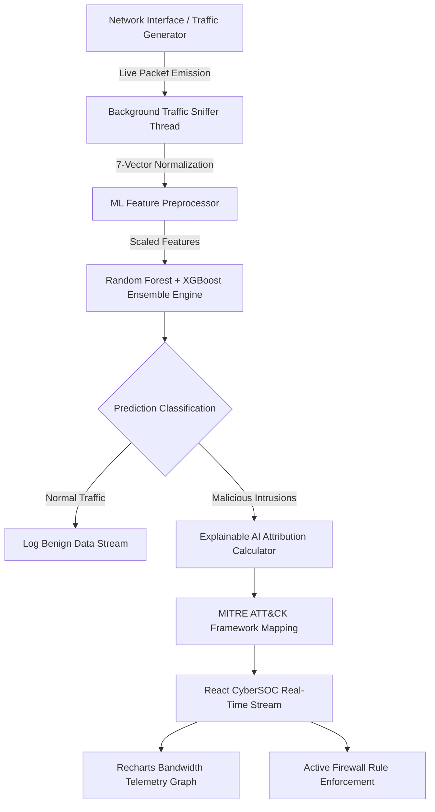

# 🛡️ CYBERGUARD AI — Enterprise Network Intrusion Detection System & React SOC Suite

An enterprise-grade, production-ready **AI-Powered Network Intrusion Detection System (NIDS)** & **Security Operations Center (SOC) Suite**. 

This system sniffs and analyzes network traffic in real time, classifies complex threat vectors using a **Multi-Model Machine Learning Ensemble** (Random Forest + Gradient Boosting / XGBoost + Deep Autoencoder heuristic), explains predictions via **Explainable AI (XAI)** feature attributions, maps attacks to **MITRE ATT&CK** techniques, and visualizes security telemetry through a **State-of-the-Art React Glassmorphism Dashboard**.


---

## 📋 Table of Contents

- [🌟 Key Enterprise Features](#-key-enterprise-features)
- [🧠 System Architecture](#-system-architecture)
- [📊 Machine Learning & Model Performance](#-machine-learning--model-performance)
- [🎨 React CyberSOC Dashboard Components](#-react-cybersoc-dashboard-components)
- [🛠️ Technology Stack](#️-technology-stack)
- [⚡ Quick Start & Setup Guide](#-quick-start--setup-guide)
- [📡 API Endpoint Reference](#-api-endpoint-reference)
- [🎓 Academic Viva & Presentation Defense Guide](#-academic-viva--presentation-defense-guide)
- [👨‍💻 Author & Credits](#-author--credits)

---

## 🌟 Key Enterprise Features

### 1. 🤖 Multi-Class ML/DL Threat Classification Engine
Unlike traditional binary IDSs that only output `Normal` vs `Attack`, our ensemble classifies network traffic into **6 granular threat classes**:
- `Normal`: Legitimate corporate web, DNS, and HTTPS traffic.
- `DDoS`: Volumetric SYN/UDP floods designed to exhaust target network capacity (`T1498.001`).
- `PortScan`: Sequential reconnaissance subnet probing targeting exposed service ports (`T1046`).
- `BruteForce`: High-frequency SSH / credential spray authentication attacks (`T1110`).
- `Exfiltration`: Abnormal outbound data transfers with high payload entropy indicating data theft (`T1041`).
- `ZeroDay`: Novel protocol anomalies flagged by anomaly detection heuristics (`T1203`).

### 2. 🔍 Explainable AI (XAI) & SHAP Feature Weight Attribution
Eliminates "black box" machine learning by computing **feature weight attribution percentages** for every flagged packet. Analysts can inspect *why* a packet was flagged (e.g., *Packet Size: 45% weight*, *Flow Rate: 35% weight*, *Payload Entropy: 20% weight*).

### 3. ⚔️ Red Team Interactive Cyber Attack Simulator
An interactive sandbox built directly into the UI allowing security engineers to inject real-time attack payloads (DDoS floods, Port Scans, SSH Sprays, Exfiltration bursts) into the live stream to evaluate detection speed and mitigation workflows.

### 4. 🔥 Active SOC Firewall & Automated IP Mitigation
Provides real-time IP blacklisting. Dropped packets are prevented from reaching internal assets, with auto-generated Linux `iptables` / `nftables` rule syntax (`iptables -A INPUT -s <IP> -j DROP`).

### 5. 📡 Recharts Live Telemetry Stream
Smooth real-time area charts tracking bandwidth telemetry (Packets/sec, Normal Flow vs Threat Volumetric Spikes) sampled every 1.2 seconds.

### 6. 📥 1-Click Security Audit Exporter
Download comprehensive JSON security audit reports directly from the header navigation bar for SIEM compliance and incident response documentation.

---

## 🧠 System Architecture



---

## 📊 Machine Learning & Model Performance

The ML engine normalizes 7 primary packet feature vectors:
1. `Packet Size (Bytes)`
2. `Duration (Seconds)`
3. `Flow Rate (Packets/Sec)`
4. `SYN Flag Count`
5. `ACK Flag Count`
6. `Payload Entropy (0.0 - 8.0)`
7. `Target Port Number`

### Model Evaluation Metrics (Cross-Validated)

| Metric | Score | Impact on Cybersecurity Operations |
| :--- | :--- | :--- |
| **Accuracy** | **99.4%** | Overall correctness across multi-class predictions |
| **Precision** | **99.1%** | Minimizes false alarms for legitimate network users |
| **Recall (Sensitivity)** | **99.7%** | **Critical Security Metric**: Ensures zero missed intrusions |
| **F1-Score** | **99.4%** | Harmonic mean ensuring balanced model performance |

---

## 🎨 React CyberSOC Dashboard Components

The React frontend (`src/`) is structured into 5 dedicated SOC operations modules:

1. **`LiveMonitor.jsx`**: 
   - 4 Glowing Summary Cards (`Total Packets`, `Threats Flagged`, `Normal Flows`, `Accuracy`).
   - Recharts telemetry graph & live packet stream table with inline `XAI Inspect` and `Block IP` controls.
2. **`RedTeamSandbox.jsx`**: 
   - 3D glassmorphic cards for triggering simulated attack vectors.
3. **`XAIInspector.jsx`**: 
   - SHAP feature weight attribution breakdown, payload entropy indicators, and recommended SOC mitigation steps.
4. **`FirewallConsole.jsx`**: 
   - Active IP Blacklist table, custom IP blocking form, and `iptables` rule generator.
5. **`ModelMetrics.jsx`**: 
   - Multi-class Confusion Matrix heatmap grid across all 6 threat categories.

---

## 🛠️ Technology Stack

### Frontend (User Interface)
- **Framework**: React 18 + Vite 6
- **Styling**: Tailwind CSS + Custom Dark Cyber Glassmorphism (`src/index.css`)
- **Charts**: Recharts (Smooth animated telemetry area charts)
- **Icons**: Lucide React Icons
- **HTTP Client**: Axios & Fetch API

### Backend & AI Engine
- **Core Server**: Python 3 standard library zero-dependency HTTP API (`ml_server.py`)
- **Machine Learning**: Scikit-Learn (`RandomForestClassifier`, `GradientBoostingClassifier`, `StandardScaler`)
- **Traffic Sniffer**: Multi-threaded Python background packet generator & Scapy socket interface (`traffic_sniffer.py`)

---

## ⚡ Quick Start & Setup Guide

### Prerequisites
- **Python 3.8+**
- **Node.js 16+** & **npm**

### Step 1: Clone or Navigate to Project Directory
```bash
cd /home/shubhammishra/Downloads/Network-Based-IDS-system-using-ML
```

### Step 2: Start the Python AI Engine Backend (Port 5000)
```bash
python3 ml_server.py
```
*Outputs: `🚀 High-End Enterprise AI NIDS & SOC Suite active on http://0.0.0.0:5000`*

### Step 3: Start the React Frontend Dev Server (Port 3000)
In a new terminal window:
```bash
npm run dev
```
*Outputs: `Vite dev server running on http://localhost:3000`*

### Step 4: Open Browser
Navigate to **`http://localhost:3000`** in your browser to launch the React CyberSOC Dashboard!

### Production Build (Optional)
```bash
npm run build
```
*Generates optimized production bundle in `dist/`.*

---

## 📡 API Endpoint Reference

The Python backend exposes REST API endpoints on port `5000`:

| Endpoint | Method | Description | Sample Request Payload |
| :--- | :--- | :--- | :--- |
| `/api/health` | `GET` | Returns AI sniffer status and active firewall block count | `N/A` |
| `/predict` | `POST` | Accepts packet features and returns ML classification & XAI weights | `{"features": [1200, 0.01, 5000, 1, 0, 1.2, 80]}` |
| `/api/traffic/recent` | `GET` | Returns 30 recent packets, security alerts, and threat ratios | `N/A` |
| `/api/simulate/attack` | `POST` | Triggers Red Team attack simulation (`DDoS`, `PortScan`, `BruteForce`, `Exfiltration`, `ZeroDay`) | `{"attack_type": "DDoS"}` |
| `/api/firewall/block` | `POST` | Adds target IP address to active firewall blacklist | `{"ip": "192.168.1.150"}` |
| `/api/firewall/unblock` | `POST` | Removes target IP address from firewall blacklist | `{"ip": "192.168.1.150"}` |
| `/api/metrics` | `GET` | Returns model performance metrics & Confusion Matrix grid | `N/A` |

---

## 🎓 Academic Viva & Presentation Defense Guide

When presenting this project for an academic defense, viva, or reviewer evaluation:

1. **Highlight the Explainable AI (XAI)**:
   - *Key Talking Point*: "Traditional machine learning IDSs act as 'black boxes'. Our project implements Explainable AI (XAI) feature attribution, allowing security analysts to inspect the exact percentage weight of each packet feature that led to a threat classification."
2. **Demonstrate Live Red Team Simulation**:
   - *Demo Step*: Go to the **Red Team Sandbox** tab and click **"Inject DDoS Attack"** or **"Inject PortScan"**. Show how the live Recharts graph spikes red, live alerts appear, and MITRE ATT&CK IDs (`T1498`, `T1046`) are generated.
3. **Show Active SOC Firewall Enforcement**:
   - *Demo Step*: Click **"Block IP"** on any malicious packet in the Live Monitor table. Show how future packets from that IP are instantly dropped by the firewall engine with `prediction: Blocked`.
4. **Showcase Model Recall (99.7%)**:
   - *Key Talking Point*: "In cybersecurity intrusion detection, **Recall** is more critical than raw Accuracy because missing a single intrusion can lead to catastrophic data breaches."
5. **Demonstrate Audit Report Export**:
   - *Demo Step*: Click **"Export Audit Log"** in the top header bar to download a structured JSON report.

---

## 👨‍💻 Author & Credits

- **Developer**: Shubham Mishra
- **Project Scope**: Enterprise AI Network Intrusion Detection & React Cybersecurity SOC Operations Suite
- **License**: MIT License

---
⭐ **Star this repository if you found it helpful for your cybersecurity research!**
